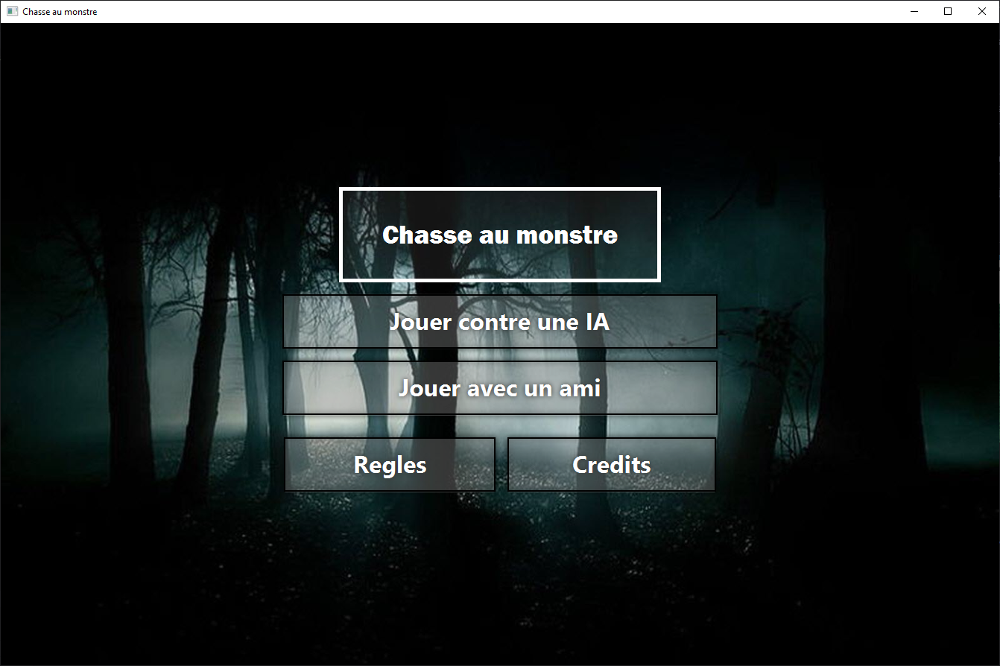
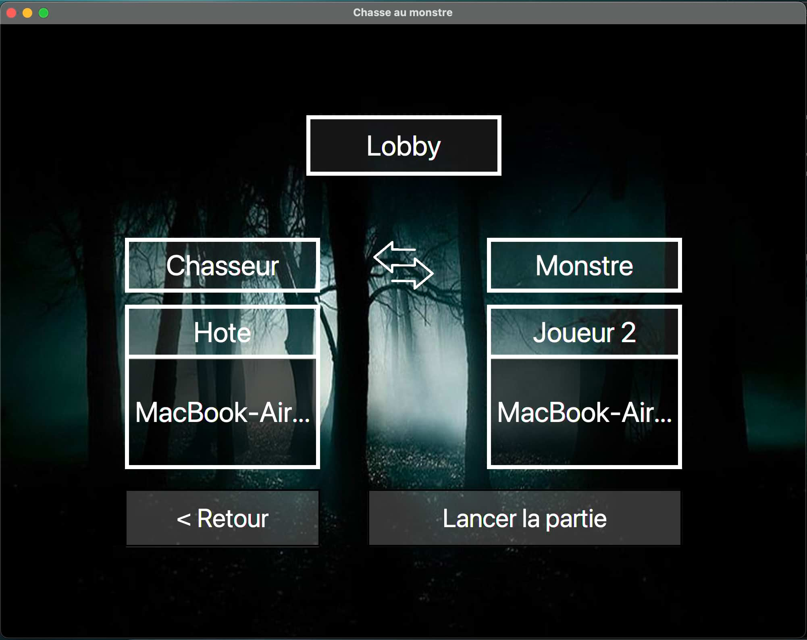
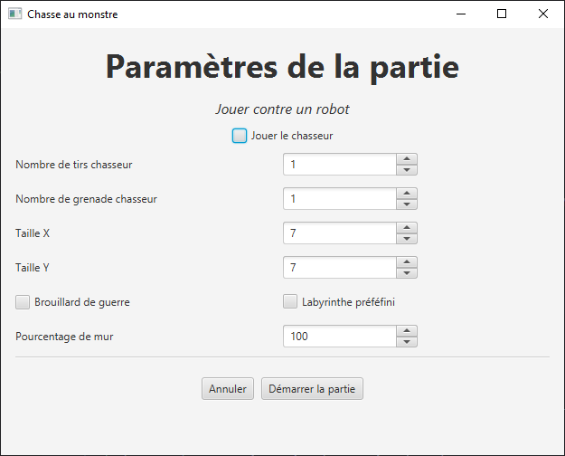
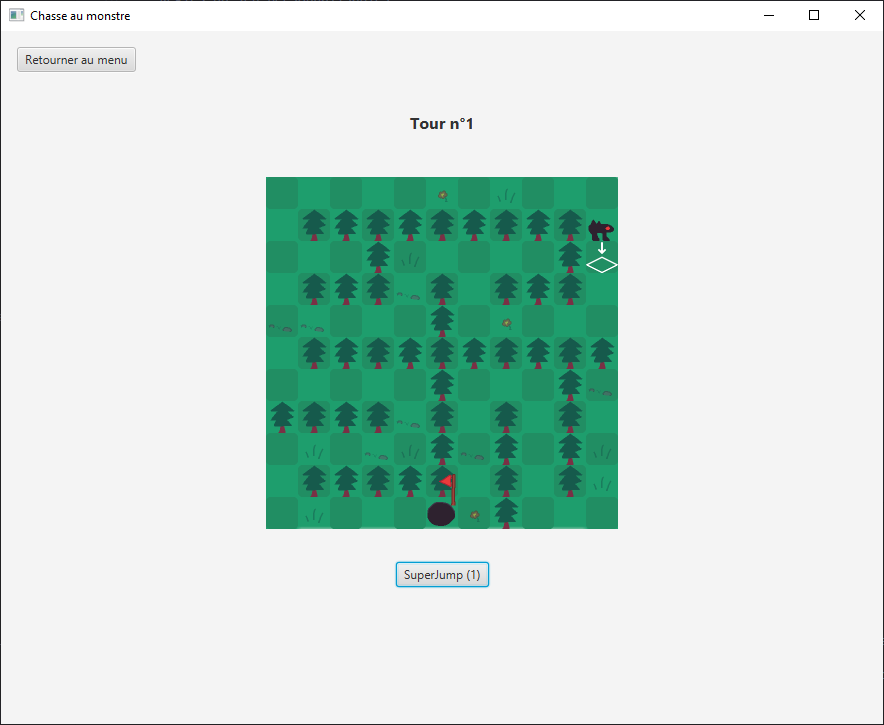
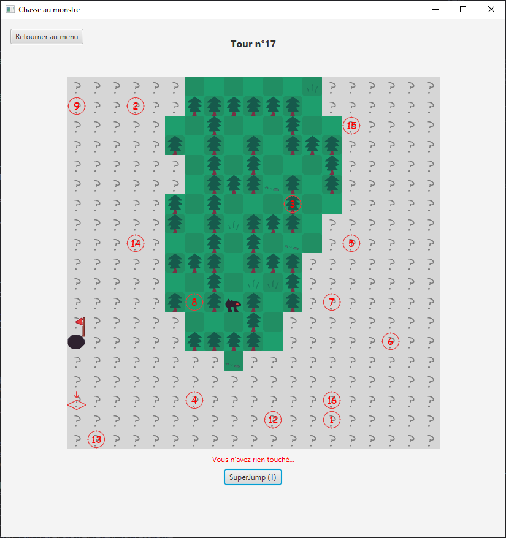

# SAÉ - Chasse au Monstre

**Groupe H1 (S3-H)**

- TOURNEUR Aymeri
- LECLERCQ Manon
- ECKMAN Nicolas
- BELGUEBLI Rayane
- GYSEMANS Thomas

## Description du projet

### Présentation

Ce projet est un jeu _"chasse au monstre"_, c'est-à-dire qu'on a un monstre et
un chasseur. L'objectif du monstre est de s'échapper en trouvant la sortie, et
celle du chasseur est de trouver et tuer le monstre.

Chaque tour, le monstre bouge et essaie de se frayer un chemin vers la sortie,
et le chasseur tire sur la case où il pense que le monstre se trouve.

### Comment jouer

Il est possible de jouer au jeu de 3 manières différentes, contre une IA, à
2 joueurs (même pc) et à 2 joueurs sur deux machines différentes d'un
**même réseau**.

Avant le début de la partie, il est possible de configurer les paramètres, tels
que la taille du labyrinthe, le pourcentage d'obstacles, un brouillard de guerre
(expliqué plus tard) et le nombre de munitions/powerups du monstre et du
chasseur.

C'est **toujours le monstre** qui commence la partie, il peut se déplacer en
appuyant via sa souris sur une case à sa portée. Il peut se déplacer au
maximum d'une case de distance à chaque fois, et les mouvements diagonales
ne sont pas admis.

Une fois que le monstre a joué, c'est au tour du chasseur. Il utilise sa
souris pour appuyer sur une case pour reveler les informations qu'elles
contient.

## Mécaniques additionnelles

- En plus des mécaniques de bases, nous avons pris le temps d'ajouter
des mécaniques supplémentaires pour rendre le jeu plus intéressant.
Les deux premières mécaniques (Grenades et SuperJump) sont des compétences
à usage unique que le monstre ou le chasseur possèdent. Elles ne régénèrent
pas, et sont paramétrables au début de la partie.

#### Grenades

- Les grenades sont l'arme additionnelle du chasseur, lui permettant de tirer dans un rayon de 3x3. C'est très pratique pour découvrir une zone pour savoir si le monstre est passé par là. 

> Note: Suite à des contraintes de temps, l'IA du chasseur ne peut pas utiliser les grenades.

#### SuperJump

- Les SuperJump sont l'une des compétences du monstre. Une fois activée, elle permet pendant un tour de sauter d'une distance de 3 au maximum. Cela permet de sauter au-dessus des arbres, très pratique pour prendre un raccourci à travers le labyrinthe.

> Note: Suite à des contraintes de temps, l'IA du monstre ne peut pas utiliser les SuperJump.

#### Brouillard de guerre

- Le brouillard de guerre est une mécanique qui montre uniquement les cases proches du monstre. Le rayon de ce paramètre est personnalisable dans les paramètres au début de la partie, et affecte plus ou moins le monstre. Les cases que le joueur a déjà parcourues sont marquées comme découvertes, et resteront visibles à l'écran, même quand le monstre s'en éloigne.

> Note: Suite à des contraintes de temps, l'IA du monstre n'est pas affectée par le brouillard de guerre, par conséquent elle n'en prendra pas compte lors de la calcul de son algorithme Dijkstra.

### Multijoueur en ligne

- Thomas Gysemans s'est chargé intégralement du mode multijoueur en ligne,
permettant à deux joueurs sur deux machines différentes de jouer. Le code
du multijoueur est disponible dans le dossier ``multiplayer``.

- Le multijoueur utilise des sockets pour transférer des données.

> Le multijoueur est par défaut disponible qu'en LAN. Néanmoins, il est
totalement possible de jouer en ligne à travers deux personnes d'un réseau
distant, en utilisant un réseau privé virtuel. (L'un des logiciels connu
s'appelle [Hamachi](https://vpn.net/)).

### Labyrinthe personalisée

Il est possible d'utiliser un labyrinthe fait par l'utilisateur à partir d'un fichier CSV. Le csv du labyrinthe est accessible sous ``src\main\resources\maze\maze.csv``.
- ``0`` représente un mur
- ``1`` représente du vide
- ``2`` représente la position du monstre de départ
- ``3`` représente la sortie

## Exécution (en utilisant le fichier .jar)

- Récupérer le fichier H1_SAE3A.jar, puis l'exécuter en utilisant la commande:

```bash
java --module-path "{chemin absolu vers les librairies JavaFX}" --add-modules javafx.controls,javafx.fxml -cp ".\H1_SAE3A.jar;lib\*" fr.univlille.App
```

## Fonctionnalités actuelles

- Menu principal
- Génération d'un labyrinthe à l'aide d'un algorithme (Recursive Backtracing)
- Utilisation d'un labyrinthe prédéfini
- Affichage de l'historique de déplacement du monstre pour le chasseur
- Affichage de l'historique de tir du chasseur pour le monstre
- Placement aléatoires du monstre et de la sortie
- Condition de victoire monstre/chasseur
- Règles du jeu personnalisables
- Vue monstre/chasseur différente
- Brouillard pour le monstre au-delà de 2/3 de distance
- Utiliser des grenades pour le chasseur
- Utiliser un "super jump" pour le monstre
- Possibilité de jouer contre une IA
- Possibilité de jouer à 2 sur un même PC
- Possibilité de jouer sur 2 PC différents à l'IUT (Multijoueur LAN)
- Utilisation d'un jar pour lancer le jeu

## Images

- Menu du jeu


- Lobby multijoueur



- Paramètres de la partie


- Gameplay jeu monstre


- Brouillard de guerre


## Jalons
### Jalon n°1

| Personne | Travail                                                       |
| -------- | ------------------------------------------------------------- |
| Rayane   | Implémenté les méthodes du JAR                                |
| Aymeri   | IHM                                                           |
| Thomas   | Commentaires, javadoc, review du code                         |
| Manon    | Tests                                                         |
| Nicolas  | Devait aider pour le javafx mais soucis pour le faire marcher |

### Jalon n°2

| Personne | Travail                                                                                       |
| -------- | --------------------------------------------------------------------------------------------- |
| Rayane   | Ajout grenade pour chasseur, superjump pour monstre, refactoring                              |
| Aymeri   | Clean code, peaufinage, brouillard de guerre, algorithme labyrinthe, paramétrage de la partie |
| Thomas   | Lobby multijoueur (un joueur peut host une game et rejoindre une game)                        |
| Manon    | IA du monstre, clean code                                                                     |
| Nicolas  | Menu en javaFX (UI), controllers                                                              |

### Jalon n°3

| Personne | Travail                                                   |
| -------- | --------------------------------------------------------- |
| Rayane   | Correction bug, ajout fonctionnalité labyrinthe prédéfini |
| Aymeri   | Clean code, création jar, écriture rapport dev efficace   |
| Thomas   | Mode multijoueur fini et fonctionnel                      |
| Manon    | Finalisation de l'IA, écriture rapport dev efficace       |
| Nicolas  | Finalisation aspect visuel                                |

