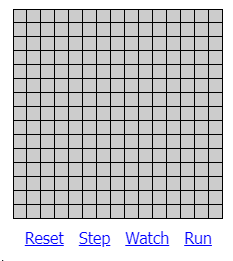
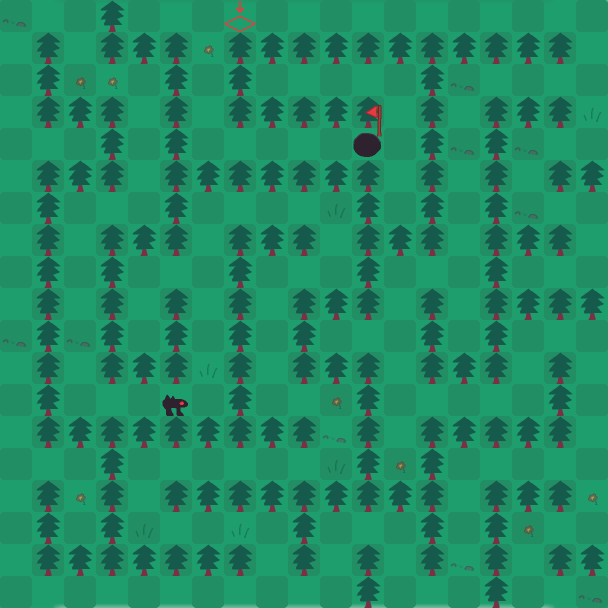
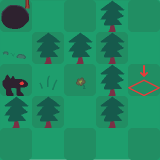
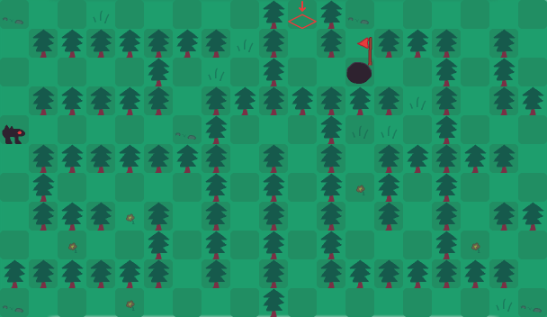
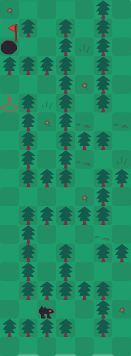

# Rapport Chasse au Monstre

## Génération de labyrinthe

### Présentation de l'algorithme

Pour cette SAÉ, nous avons choisi l'algorithme *Recursive Backtracing*. Comme son nom l'indique, c'est un algorithme récursif qui retourne sur ses pas (backtracking).

C'est un algorithme que nous avons choisi pour plusieurs raisons :
- L'algorithme est très simple à implémenter (malgré le fait qu'il soit récursif)
- L'algorithme est rapide sur n'importe quelle taille de labyrinthe, carré ou rectangulaire.
- C'est un algorithme que je connais, ayant déjà eu l'occasion de l'implementer au S1 lors de la SAÉ du jeu ludo-pédagogique.

Néanmoins, comme **points négatifs** on peut souligner que :

- Certaines cases seront tout le temps des obstacles (les cases où les coordonnées sont toutes les deux impaires), ce qui réduit de 25% les cases à surveiller pour le chasseur.
- Le monstre et la sortie ne se trouvent jamais à la même position au premier tour pour ne pas permettre au chasseur de toujours gagner au premier tour, ce qui peut grandement avantager le monstre s'il commence près de la sortie.
- Sur des labyrinthes très grands, le fait qu'il n'existe qu'un seul et unique chemin vers la sortie peut rendre l'expérience frustrante lors qu'il rencontre une impasse.

L'algorithme du labyrinthe se trouve dans la classe `src\main\java\fr\univlille\Maze.java`. Une classe de test se trouve également dans `src\main\tests\fr\univlille\TestMaze.java`.

### Fonctionnement de l'algorithme

- L'algorithme est un algorithme récursif. À chaque appel, il va regarder dans les quatre cases autour de lui. Si les cases ne sont pas explorées, alors il va appeler la méthode dans cette case, etc... Au final, toutes les cases du labyrinthe seront explorées, et aucune case ne sera inaccessible. Il n'existe qu'un seul et unique chemin de l'entrée à la sortie.

- Dans `Maze.java`, nous utilisons également une seed pour générer le labyrinthe. Notre jeu ayant du multijoueur en ligne, cela permet aux deux utilisateurs de partager la même carte. Dans notre jeu, une mécanique s'appellant le "SuperJump" permet au monstre de sauter par-dessus un arbre pour faciliter la navigation dans le labyrinthe.

- Nous utilisons comme structure de données un tableau de boolean de taille X et Y, représentant le labyrinthe. true signifie un mur, et false une case vide.

### Efficacité

L'algorithme étant récursif, il est assez difficile d'estimer la complexité de l'algorithme. Dans le pire des cas, la complexité sera de l'ordre O(N²) où N est le nombre total de cellules. Cela se produit quand les mêmes cases sont explorées plusieurs fois. Dans le meilleur des cas, la complexité est de O(N). En situation réelle, on est plus proche de O(N) que de O(N²). Tout cela dépend de plusieurs paramètres, comme la position de départ, ou encore en fonction des directions qui sont choisies aléatoirement.

### Explication de l'algorithme

- Voici l'algorithme en pseudo-code (le code dans la classe Java est très similaire):

```py
fonction recursiveBacktrack(currentX, currentY) :
    directions = [[0, -2], [0, 2], [-2, 0], [2, 0]] # Les 4 directions possibles (gauche, droite, haut, bas).
    # Ici, on utilise des directions de longueur 2, car dans le jeu, les murs sont solides et sont considérés comme des cases.
    mélanger(directions) # On mélange aléatoirement les 4 directions

    pour chaque direction de directions :
        # On calcule la nouvelle position x et y
        newX = currentX + direction[0]
        newY = currentY + direction[1]

        # On vérifie d'abord si la case est dans la zone de jeu (c'est à dire qu'elle est comprise entre 0 et la taille du labyrinthe).
        # Puis si la case n'a pas déjà été visitée.
        si (newX >= 0 et newX < tailleX et newY >= 0 et newY < tailleY) et maze[newY][newX]
            # On ouvre le mur entre la nouvelle case et la case précedente.
            maze[currentY + direction[1] / 2][currentX + direction[0] / 2] = faux
            
            # Marque la nouvelle case comme visitée
            maze[newY][newX] = faux

            # Appel récursif pour explorer la nouvelle cellule
            recursiveBacktrack(newX, newY)
        fin si
    fin pour
fin fonction
```

### Illustration 

- Voici une animation illustrant cet algorithme. Dans l'exemple, les murs sont de simples traits, tandis que dans notre projet les murs sont des cases entières.



> L'illustration vient du site [jamisbuck.org](https://weblog.jamisbuck.org/2010/12/27/maze-generation-recursive-backtracking)

### Captures d'écran

- Voici des captures d'écrans servant d'exemples de génération du labyrinthe pour notre jeu:

- Un labyrinthe carré de taille 19x19 (la taille maximale dans le jeu, non pas pour des raisons de performances ou d'efficacité mais simplement car sinon le jeu devient impossible pour le chasseur) :



- Un labyrinthe de taille 5x5, la taille minimum :



- Deux labyrinthes rectangulaire.





## IA Chasseur

### Présentation de l'algorithme

Pour l’IA du chasseur, nous avons implémenté une stratégie similaire à celle humaine : tirer au hasard. On utilise la hauteur et largeur du labyrinthe pour produire une ICoordinate randomisée à l’aide d’un attribut de type Random.

Faute de temps, nous n'avons pas implémenté de stratégie pour les situations particulières telles que "Si le chasseur tire sur une case numérotée, il regardera une case qui se trouve à 'numéro du tour - numéro sur la case' distance de la case sur laquelle il vient de tirer".

### Classe

Cette stratégie est implémentée dans HunterStrategy.java.

### Pseudo-code
```
INITIALISATION :
    largeur = largeur_labyrinthe
    hauteur = hauteur_labyrinthe
CHAQUE TOUR :
    retourner ICoordinate (Random 0-largeur, Random 0-hauteur)
```

### Coût

On a un coût relativement faible, car il prend un nombre au hasard à chaque fois, donc il n'y a aucune boucle, aucune condition.

## IA Monstre

### Présentation de l'algorithme

Pour l'IA du monstre, j'ai implémenté l'algorithme de Dijkstra, qui permet de trouver le chemin le plus court dans un graphe. 

J'ai choisi cet algorithme pour plusieurs raisons :

- Dijkstra est préférable à BFS dans cette situation car nous recherchons le chemin le plus court, préférable à Bellman-Ford car nous ne gérons pas de coûts négatifs, et je ne suis pas familière pas les autres donc j'ai limité ma recherche d'algorithme optimal à "Dijsktra ou A* ?".

- J'ai déjà implémenté Dijkstra dans le passé, notamment sur un projet au lycée lors de la découverte de graphes en NSI, donc je connais déjà le fonctionnement même si c'était en Python à l'époque.

- Nous avons choisi d'implémenter un labyrinthe de 19x19 au maximum car sinon c'est impossible pour le chasseur (comme dit ci-dessus), donc la performance qu'apporterait A* par rapport à Dijkstra ne vaudrait pas la peine d'être implémentée car on a un labyrinthe petit. À cause de cela, j'ai préféré privilégier une solution que je suis sûre de pouvoir implémenter (Dijkstra) plutôt qu'implémenter A* et me tromper sur les heuristiques, par contrainte de temps à cause des nombreux problèmes dus à JavaFX sur mon ordinateur notamment.

### Classe

Cette stratégie est implémentée dans MonsterStrategy.java.

### Structures de données

Trois listes à double dimensions, une liste de boolean _visited_ pour "est-ce que cette case a été visitée ?", une liste d'int _distance_ pour "quelle est la distance de cette case par rapport au monstre ?" et une liste de ICoordinate _visitedFrom_ pour retrouver le chemin duquel on vient.

Par exemple, pour un labyrinthe de 5 par 5, on dit que le monstre se trouve sur la case [0,0] et la sortie [4,4]. Sur la case [0,1], on regarde si la distance cumulée actuelle (distance [0,0] (0) + distance entre chaque case (1) = 1) est inférieure à la distance stockée dans la liste _distance_ (ici __infini__ pour l'instant), et si elle l'est on la stocke à la place de la distance précédente dans cette même liste.

À la fin, il faudra retracer le chemin, alors on stocke d'où on vient dans la liste _visitedFrom_, ici (0,0). Cela nous permet de boucler sur la sortie jusqu'au monstre pour trouver le chemin le plus court.

À chaque tour, on choisit la distance la plus courte parmi _distance_. Alors, pour éviter de boucler sans fin, on a la liste _visited_ dans laquelle les cases qu'on a déjà utilisées sont à __true__. On n'utilisera alors plus ces cases jusqu'au tour d'après.

Chaque fois que le monstre doit jouer, on relance l'algorithme pour retrouver le chemin le plus court.
Si nous avions implémenté le fait que le chasseur utilise les cases marquées avec le numéro du tour (comme exprimé précédemment), le fait qu'on relance l'algorithme à chaque tour nous aurait permis de faire jouer au monstre la stratégie suivante : "si le chasseur a tiré sur cette case, il sait que je suis là, donc je vais trouver un autre chemin où aller".

### Coût

En général, sans considérer le pire des cas spécifique avec un agencement malveillant des murs, la complexité sera proportionnelle à `O((C+M) log C)` où C est le nombre de cases dans le labyrinthe et M est le nombre de mouvements possibles entre les cases. Si on explore tous les noeuds du labyrinthe, on se rapproche du pire des cas dans lequel on aurait `O(C*C)` (où C est toujours le nombre de cases dans le labyrinthe). Alors, pour un labyrinthe de taille 19x19, on aurait un coût proche de 361.